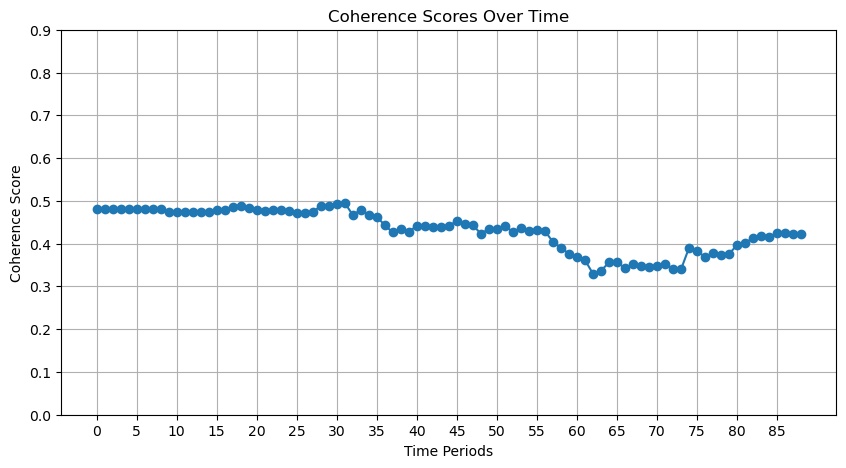

Utilizar métricas específicas y adecuadas para evaluar la validez de los resultados obtenidos en la Entrega 3 y documentar en el fichero evaluation.md:

Descripción de las Métricas Utilizadas: Explicar qué métricas se emplearon y por qué son relevantes para evaluar los resultados.

Resultados de las Evaluaciones: Presentar los valores obtenidos de cada métrica y discutir su significado en el contexto del análisis.

Limitaciones en la Evaluación: Describir cualquier limitación o desafío en la aplicación de estas métricas (p. ej., tamaño de muestra, sesgo de datos).

# Tecnica 1: Latent Dirichlet allocation (LDA)

## Coherence Score

La métrica de coherencia de tópicos es una medida fundamental para evaluar la calidad de los tópicos generados por el modelo LDA. En este caso, se utilizó la implementación de la métrica C_v de la librería gensim, la cual calcula la coherencia de un conjunto de palabras dentro de un tema. Esta métrica se basa en la idea de que las palabras que coexisten frecuentemente en contextos similares (en documentos o dentro de un corpus) son más semánticamente coherentes entre sí. El método C_v se enfoca en medir la similitud semántica entre las palabras más representativas de un tema, utilizando el embedding de palabras en este caso un bow (bag of words) para calcular la coherencia de los tópicos generados. Los valores de coherencia de tópicos varían entre 0 y 1, donde un valor más alto indica una mayor coherencia semántica entre las palabras de un tópico.

La coherencia de tópicos es importante porque nos da una indicación de si las palabras que componen un tópico están relacionadas entre sí de manera significativa. Un alto valor de coherencia sugiere que las palabras dentro de un tópico comparten un contexto semántico similar, lo que implica que el tópico es interpretable y consistente. 

En este caso en el modelo obtuvo un coherence score de 0.503. Este valor indica que los tópicos generados por el modelo LDA tienen una coherencia moderada.

En este caso la mayor limitación surge de la naturaleza del corpus y realizar un preprocesado exhaustivo dado que como se comentará en la sección de resultados los tópicos comunmente tienen palabras o muy generales o solamente de empresas concretas. Quizá con un preproceasado para evitar nombres de empresas y otros tickers de bolsa se pudiera mejorar la coherencia de los tópicos.

## Log Perplexity

El log-perplexity es otra métrica comúnmente utilizada para evaluar modelos de tópicos, en particular en el contexto de LDA. En este caso, se utilizó el valor de log-perplexity de la librería gensim para medir qué tan bien el modelo es capaz de predecir nuevos documentos a partir de los tópicos generados.

La perplejidad mide cómo de bien el modelo representa el corpus utilizado. Cuanto más bajo sea el valor de perplejidad, mayor calidad tiene el modelo. Se calcula teniendo en cuenta la probabilidad de observar cada palabra dada la distribución de tópicos en el corpus y la distribución de palabras en cada tópico.

El log-perplexity es simplemente el logaritmo de la perplejidad, lo que permite interpretarlo de manera más fácil. Cuanto más bajo es el log-perplexity, mejor es el ajuste del modelo.

En este caso, el modelo LDA obtuvo un log-perplexity de --8.193. Un valor negativo indica que el modelo es capaz de predecir correctamente las palabras en un documento, lo que sugiere que el modelo LDA tiene un buen ajuste a los datos.

# Tecnica 2: Modelo dinámico de tópicos (DTM)

## Coherence Score

La métrica de coherencia de tópicos también se puede aplicar a modelos dinámicos de tópicos, como el DTM. En este caso, se utilizó la implementación de la métrica C_v de la librería gensim para evaluar la coherencia de los tópicos generados por el modelo DTM en cada uno de los períodos de tiempo.

Tiene la misma interpretación que en el caso de LDA, donde un valor más alto indica una mayor coherencia semántica entre las palabras de un tópico.

La gráfica de coherencia de tópicos a lo largo del tiempo es la siguiente:

En este caso, el modelo DTM obtuvo un coherence score en torno al 0.5, aunque está métrica fue decreciendo a lo largo del tiempo. Esto sugiere que los tópicos generados por el modelo DTM son moderadamente coherentes, pero que la coherencia disminuye a medida que avanzamos en el tiempo.

Como limitación, cabe destacar que debido a la cantidad de datos manejados y la complejidad del modelo DTM, el tiempo de entrenamiento y evaluación del modelo se realizó sobre una muestra aleatoria simple de 1000 noticias. Esto puede afectar a como de representativos son los tópicos generados y por lo tanto las métricas obtenidas.

# Tecnica 5: Modelado de Series Temporales
## Descripción de las Métricas Utilizadas

**MAE (Error Absoluto Medio)**  

El MAE mide el promedio de los errores absolutos entre los valores predichos y los valores reales. Es útil porque proporciona una idea clara de la magnitud promedio de los errores en la misma unidad que los datos. En nuestro caso, ayuda a evaluar cuánto difieren los valores predichos de los precios reales de las acciones o del sentimiento.

**RMSE (Raíz del Error Cuadrático Medio)**  

El RMSE es similar al MAE, pero penaliza más los errores grandes al elevarlos al cuadrado antes de promediarlos. Esto lo hace especialmente útil para detectar modelos que pueden tener problemas con valores atípicos o grandes desviaciones. Nos ayuda a identificar modelos que predicen consistentemente bien, incluso en situaciones desafiantes.

**Prueba de Dickey-Fuller**  

Esta prueba verifica si los datos son estacionarios. Aunque sabemos que los valores de la bolsa no son estacionarios, utilizamos esta prueba para confirmar que los valores de cierre de las acciones de Apple tampoco son estacionarios.

Correlación de Pearson  

Mide la fuerza y dirección de la relación lineal entre dos variables, en este caso, entre el sentimiento de las noticias y los precios de las acciones. Esto es importante para analizar si los cambios en una variable están relacionados con cambios en la otra.

## Resultados de las Evaluaciones

La comparación muestra que los modelos ARIMA y ARIMAX tienen errores significativamente más bajos en comparación con MAX, indicando que incluir el sentimiento como un factor externo mejora la predicción en el caso de ARIMAX. Sin embargo, MAX no logra capturar bien las relaciones bidireccionales entre las variables.

| **Modelo**           | **MAE**    | **RMSE**  | **Comentarios**                                          |
|----------------------|------------|-----------|----------------------------------------------------------|
| **ARIMA**            | 1.70       | 2.03      | Modelo base sin variables exógenas.                      |
| **ARIMAX**           | 1.27       | 1.57      | Mejora al incluir sentimiento.                           |
| **MAX - Sentiment**  | 154.62     | 192.72    | Altos errores; relación no significativa.                |
| **MAX - Stock**      | 131.08     | 165.29    | Peor rendimiento que ARIMA/ARIMAX.                       |

Los valores de error (MAE y RMSE) en el modelo ARIMAX son menores que en el modelo ARIMA.
Esto sugiere que incluir el sentimiento como variable exógena mejora la capacidad predictiva del modelo respecto al rendimiento del stock.

Resultados de la Prueba Dickey-Fuller (p = 0.999) confirma que los datos no son estacionarios, lo cual era esperado dada la naturaleza de los precios de las bolsa.
Estadístico ADF = 2,43 (mayor que los valores críticos): No se rechaza la hipótesis nula de no estacionariedad.

El coeficiente r≈0 de correlación de Pearson muestra que la relación entre el sentimiento y los precios de las acciones es débil, lo que sugiere que el sentimiento tiene una influencia limitada.

## Limitaciones en la Evaluación

**Disponibilidad de datos**  

Los datos iniciales de 2012 a 2015 no contienen noticias relevantes, y los datos de sentimiento se vuelven dispersos durante la pandemia (2020). Esto dificulta la creación de modelos consistentes.

**Baja correlación**  

Aunque la relación entre el sentimiento y los precios es significativa, su fuerza es muy baja. Esto limita la aplicabilidad de modelos que asuman una conexión directa entre ambas variables.

**Impacto de eventos externos**

La pandemia de COVID-19 causó caídas significativas en los precios de las acciones, pero estas no están relacionadas directamente con el sentimiento, ni con la politica de EEUU, complicando las interpretaciones.
