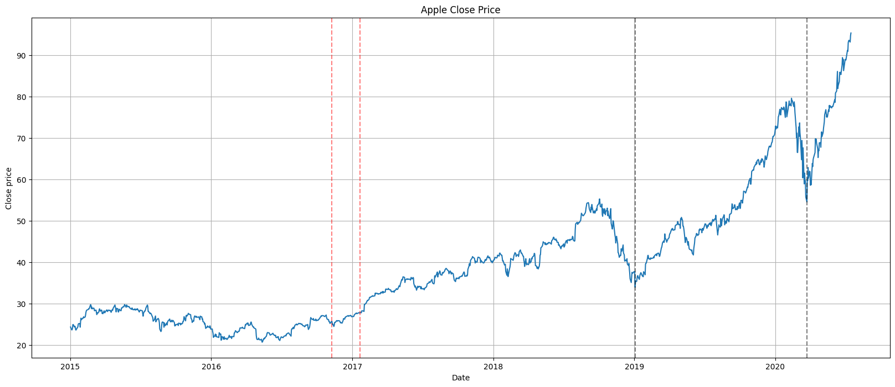
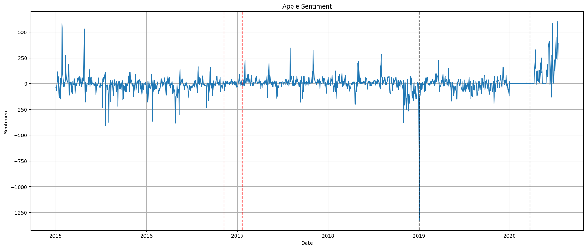
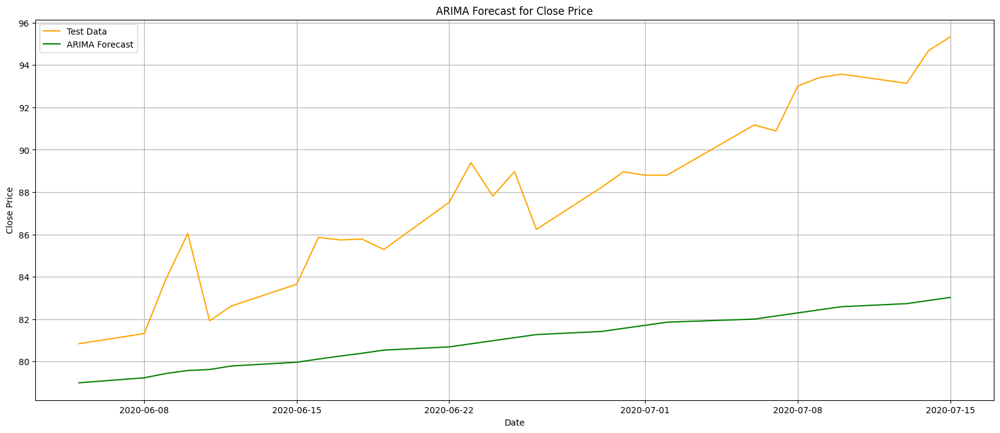
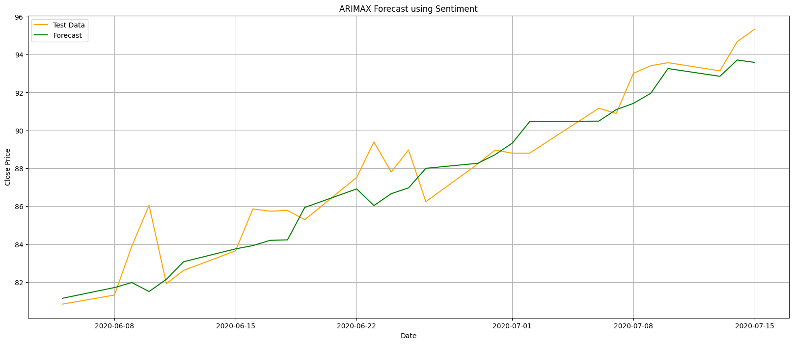
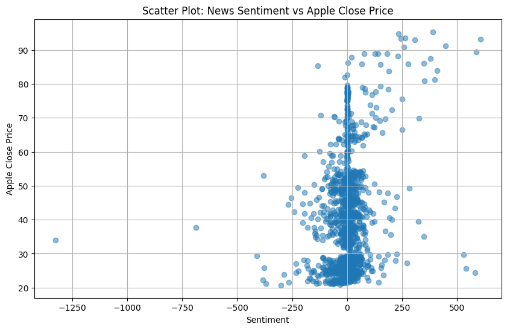
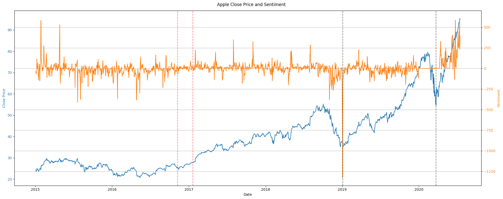

Elaborar un análisis detallado de los resultados obtenidos en un documento titulado interpretation.md:

Análisis de Patrones Descubiertos: Interpretar los patrones, relaciones y tendencias identificadas en los datos, explicando qué significan en el contexto del problema planteado.

Relación con las Preguntas de Investigación: Conectar los resultados obtenidos con las preguntas de investigación o hipótesis formuladas en la Entrega 2. Identificar claramente si los hallazgos apoyan o contradicen las hipótesis iniciales.

Ejemplos Ilustrativos: Proporcionar ejemplos específicos de los datos que ilustren los patrones o resultados más significativos.

# Filtro de Hampel: Los días detectados como outliers por el filtro Hampel en la serie temporal de rendimiento del indice NASDAQ en el periodo 2012-2020 coinciden con días en los que un evento político importante tuvo lugar.

Utilizando el filtro de hampel en la serie agregada de los tickers a estudiar se obtienen 50 diferentes valores atípicos. Buscando noticias de los sucesos en 10 de estos días se observó como comunmente se aprecian noticias de eventos relacionados con la especulacion del mercado, algunos eventos politicos como ayudas de bancos centrales y muy comunmente eventos referentes al precio del petroleo.

Dados los resultados aunque algunos eventos se pueden atribuir a eventos politicos menores, la mayoria son fruto de la especulación del mercado y eventos comunes del mercado. Por lo que no se puede concluir que los eventos politicos sean los causantes de los valores atípicos.

Ejemplos de esto son:
| Fecha       | Diferencia         | Razón                                                                 | Referencia |
|-------------|--------------------|-----------------------------------------------------------------------|------------|
| 2012-08-09  | 1.360670e+11       | Overperformed: Central bank action to help economy. Lower jobless rates in the US. | [Fuente](https://www.benzinga.com/news/12/08/2819781/market-wrap-for-august-9-2012) |

# LDA y DTM: Los temas dominantes en las noticias financieras durante la presidencia de Obama están más enfocados en la recuperación económica post-crisis de 2008, mientras que los temas dominantes durante la presidencia de Trump están más relacionados con conflictos comerciales y políticas proteccionistas.

# Relación entre el sentimiento de las noticias y el precio de cierre de las acciones de Apple

## Análisis de los Patrones Descubiertos

**03/01/2019**  
El precio de las acciones cayó bruscamente debido a las proyecciones de ingresos reducidas de Apple, reflejando preocupaciones sobre las ventas en China. Esto se correlaciona con un sentimiento notablemente negativo ($−1325$), que coincide con una cobertura mediática negativa.

**23/03/2020**  
Aunque el precio de las acciones cayó visiblemente, esto fue causado principalmente por la pandemia de COVID-19 y no por noticias específicas relacionadas con Apple. Aquí, el sentimiento no tuvo un impacto directo en los precios.
        
No se han notado cayos relacionados con la presidencia de Donald Trump (lineas rojas).

## Relación con las Preguntas de Investigación

### La predicción de la serie temporal de rendimiento del stock de Apple en bolsa en el periodo 2012-2020 obtiene mejores métricas al usar como variable exógena el sentimiento de las noticias y tweets financieros relacionados con el stock.

  

MAE: 1.70     	
RMSE: 2.03   

  

MAE: 1.27        		
RMSE: 1.57    

Se puede ver que, cuando usamos el sentimiento de las noticias como la variable exógena en el modelo ARIMA, los valores de los errores MAE y RMSE son más bajos. También se puede ver en las gráficas que el modelo se ajusta mejor a los datos.

### ¿Influye el sentimiento en los precios de las acciones? 
La influencia es limitada y depende de eventos específicos (como el 03/01/2019). La correlación general es débil.
    
### ¿Influyen los precios de las acciones en el sentimiento?
No se encontró evidencia significativa para esta hipótesis, lo que sugiere que el sentimiento está más influenciado por eventos externos que por las fluctuaciones del mercado.

    
## Visualizaciones

**Scatterplot de Close Price y Sentimiento**

  

Salvo algunas excepciones, la correlación entre valores es cercana a 0.

**Los valores bursátiles de Apple y el sentimiento de las noticias a lo largo del tiempo**

  
