# Tecnica 1: Latent Dirichlet allocation (LDA)

## WordCloud

Como primer resultado vamos a visualizar las palabras más importantes de cada tópico en un WordCloud.

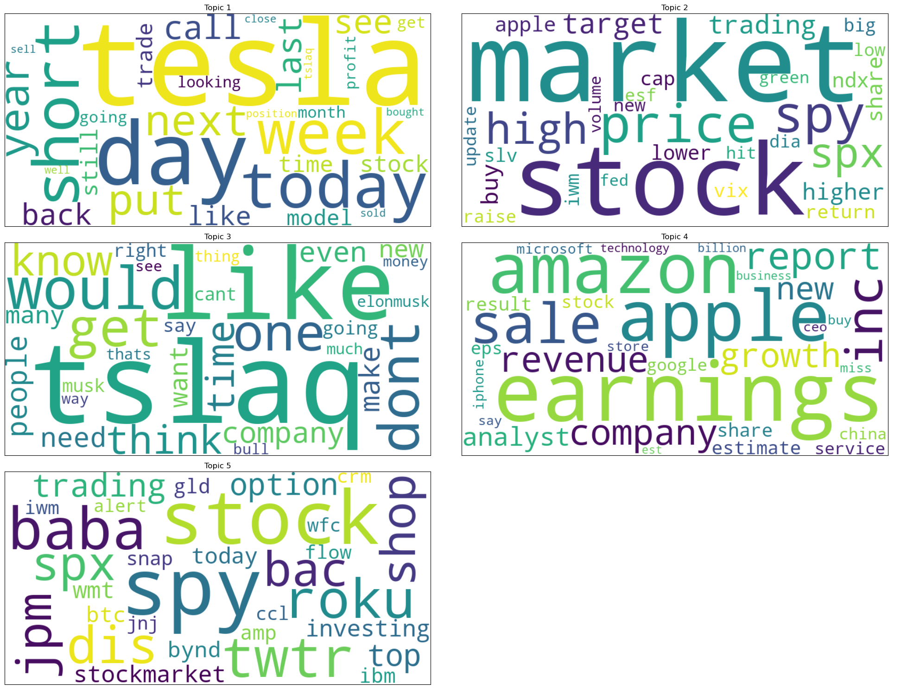

## Palabras más importantes de los tópicos

De los 5 tópicos extraido por el método LDA mostramos aquí los pesos de las 5 palabras más importantes de cada tópico.

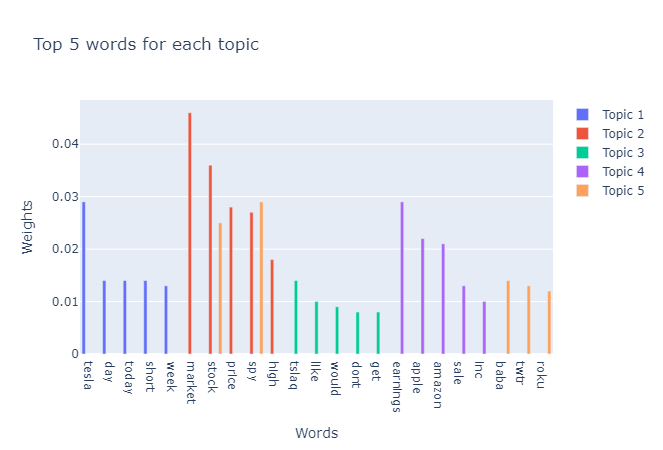

Se puede ver como pocas palabras se superponen entre los tópicos, lo que indica que los tópicos son distintos entre sí. Sin embargo, vemos que los tópicos contienen palabras que no parecen tener un significado claro, como baba, roku, twtr, tslaq, etc. Que son nombres de empresas o tickers de la bolsa los cuales no aportan información relevante a los tópicos. Aunque se hayan quitado los tickers utilizados para el analisis vemos como aparecen tickers de otras empresas o los nombres completos de empresas cuyos tickers si se han analizado.  

## Significado de los tópicos

Topic 0: 0.029*"tesla" + 0.014*"day" + 0.014*"today" + 0.014*"short" + 0.013*"week"
Topic 1: 0.046*"market" + 0.036*"stock" + 0.028*"price" + 0.027*"spy" + 0.018*"high"
Topic 2: 0.014*"tslaq" + 0.010*"like" + 0.009*"would" + 0.008*"dont" + 0.008*"get"
Topic 3: 0.029*"earnings" + 0.022*"apple" + 0.021*"amazon" + 0.013*"sale" + 0.010*"inc"
Topic 4: 0.029*"spy" + 0.025*"stock" + 0.014*"baba" + 0.013*"twtr" + 0.012*"roku"

1. El primer tópico parece centrarse en noticias y movimientos relacionados con Tesla, con palabras como "tesla", "day", "today", "short" y "week". Puede reflejar conversaciones sobre el desempeño diario de la acción, así como ventas en corto y perspectivas semanales.
2. El segundo tópico se orienta a una visión más general del mercado de valores, con palabras como "market", "stock", "price", "spy" y "high". Probablemente abarca análisis sobre el rendimiento general del mercado, precios y el SPY (SPDR S&P 500 ETF Trust) el cual es un ETF (Exchange-Traded Fund) que sigue el índice S&P 500 para medir el rendimiento del mercado de valores.
3. El tercer tópico incluye palabras como "tslaq", "like", "would", "dont" y "get". Este tópico parece estar relacionado con discusiones subjetivas y opiniones sobre Tesla, probablemente de tono crítico o especulativo, reflejado en el término ["tslaq"](https://en.wikipedia.org/wiki/TSLAQ) el cual es un colectivo de personas que hacen ventas en corto de Tesla (se benefician si el precio de la acción baja) y que critican a la empresa y su CEO Elon Musk.
4. El cuarto tópico combina términos como "earnings", "apple", "amazon", "sale" e "inc". Esto sugiere un enfoque en informes de ganancias y actividades comerciales de grandes corporaciones como Apple y Amazon, vinculadas al rendimiento empresarial.
5. El quinto tópico menciona "spy", "stock", "baba", "twtr" y "roku". Este parece abordar acciones individuales de empresas específicas como Alibaba (BABA), Twitter (TWTR) y Roku, en el contexto del mercado general representado por SPY.

Vemos como en los tópicos es común encontrar palabras que representan empresas, en concreto aquellas que tienen un gran peso en el mercado de valores (en las fechas 2012-2020) como Tesla, Apple, Amazon, Alibaba, Twitter y Roku (empresas de tecnología y redes sociales).

## Heatmap
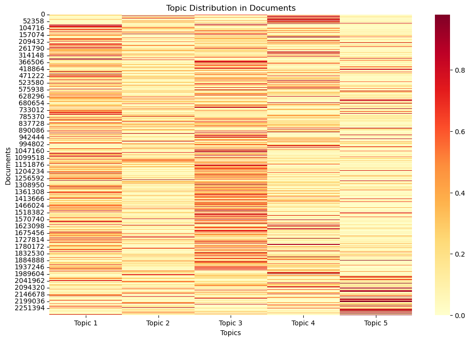

Vemos como los tópicos 1 y 3 presentan bastante fuerza en general teniendo a través de todo el corpus valores altos. Otros tópicos como el 4 y el 5 parecen tener ejemplos en losque son con gran intensidad los mas relevantes en esos documentos pero no son tan frecuentes en el corpus. El topico 2 parece ser el que menos fuerza tiene en general.

## Distribución de tópicos en el corpus

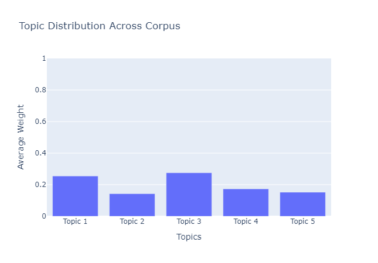

Como se pudo ver en el heatmap, los tópicos 1 y 3 son los que tienen mayor presencia en el corpus, seguidos por el tópico 4, 5 y 2.

# Tecnica 2: Modelo dinámico de tópicos (DTM)

## Coherence Over Time

Graficando la coherencia en base a los time slices obtenemos el siguiente gráfico:

Vemos como la coherencia de los topicos comienza con un valor del 0.5 bastante estable y a partir de la mitad del tiempo comienza a bajar hasta llegar a un valor minimo de alrededor de 0.32 para luego subir un poco sin llegar a los valores iniciales, quedando en un valor de 0.42.

Graficando como cambian los pesos de las 5 palabras más importantes de cada tópico en el tiempo obtenemos el siguiente gráfico:

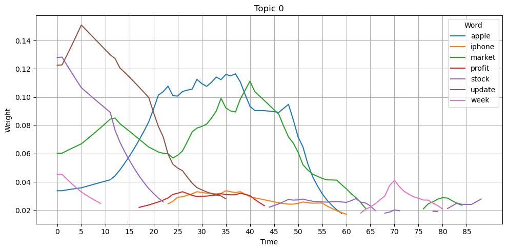

Se ve como comienza "apoyandose" en terminos generales como "update", "week", "market" y "stock" pero medida que progresa el tiempo se va centrando en palabras más especificas, principalmente "apple" y "market". Hacia el final del corpus se ve como los pesos decaen y el topico se vuelve menos relevante, no teniendo palabras con un peso muy alto.

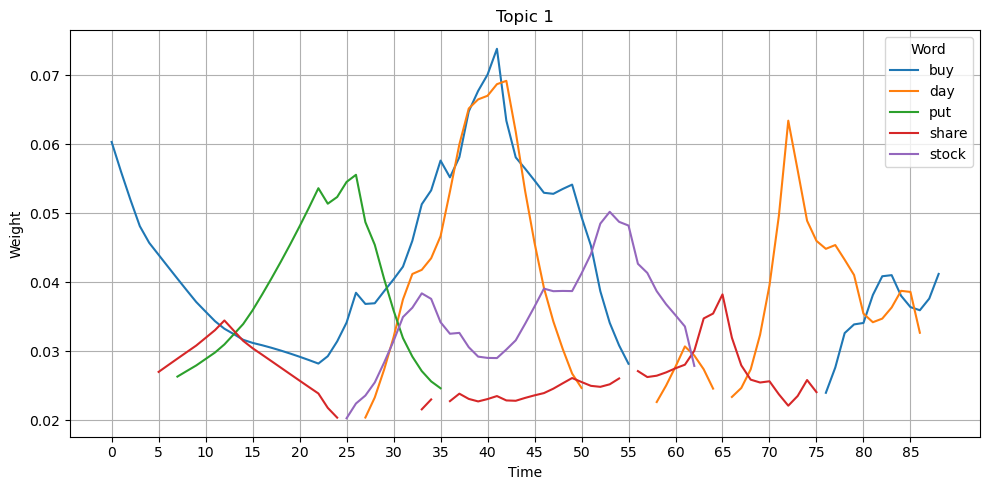

En este caso vemos como el topico comienza fuertemente con la palabra "buy" y luego añade "put", "day" "share" y stock" palabras bastante generales sobre el mercado de valores. 

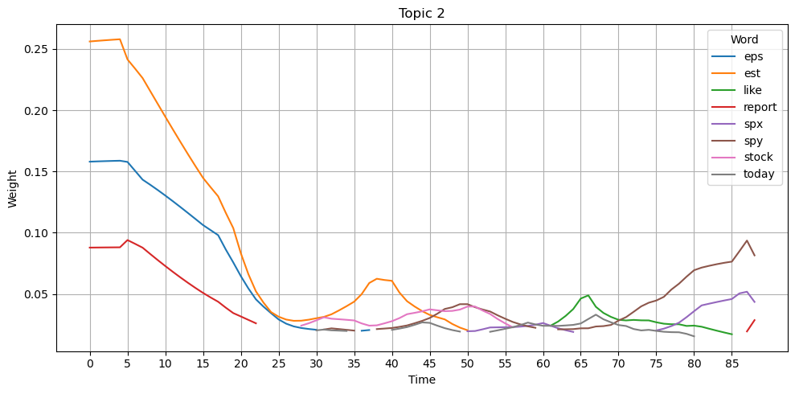

Este topico integra con gran peso palabras como "est" (estimaciones), "eps" (earnings per share), report (reportes probablemente de ganancias). Hacia el medio del corpus todos los pesos se decrementan, siendo un topico que se vuelve menos relevante y hacia el final gana algo de fuerza con palabra como "spy" (ETF que sigue el S&P 500) y "spx" (simbolo de S&P 500). Que puede hablar de ganancias y perdidas en el mercado de valores de forma general.

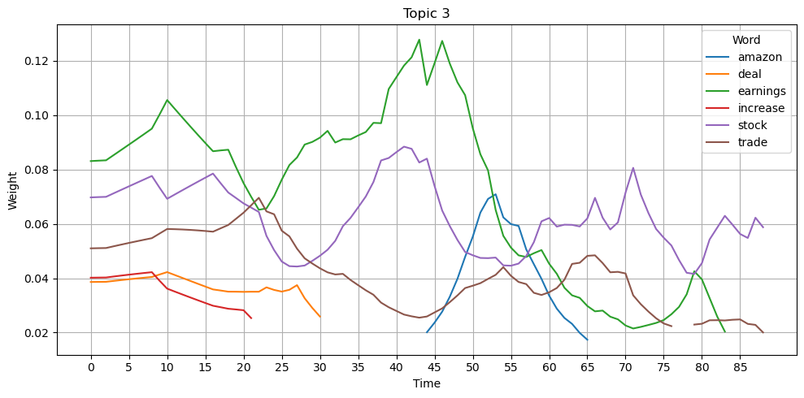

Este tópico tiene como palabra mas importante durante la mayoria de su tiempo "earninings" seguido de "stock" y luego "trade". Palabras que hablan de ganancias, acciones y comercio en general. Hace en un tiempo pequeño aparicion la palabra "amazon", tambien "deal" y "increase" con menos peso.

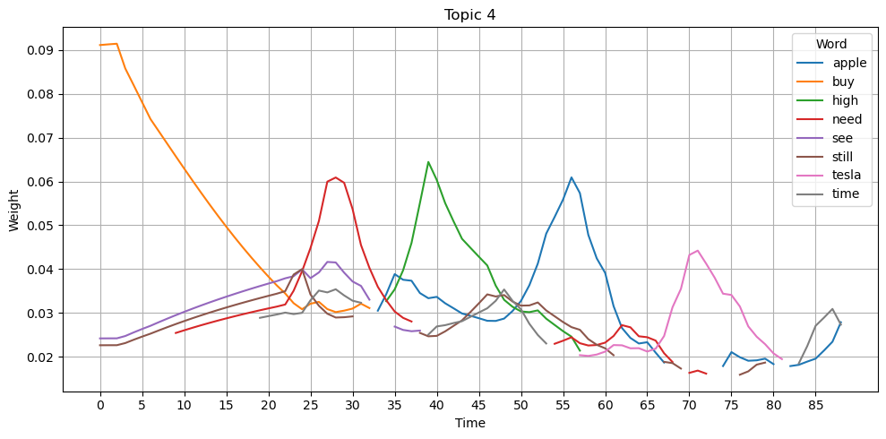

Este tópico comienza con como una palabra con algo de fuerza diferenciada "buy" la cual no aporta mucha informacion sobre el topico. Luego se va centrando en palabras, sobretodo una de cada vez en picos de relevancia, "need", "high", "apple" y "tesla".

Graficando la similitud entre los tópicos obtenemos el siguiente gráfico:
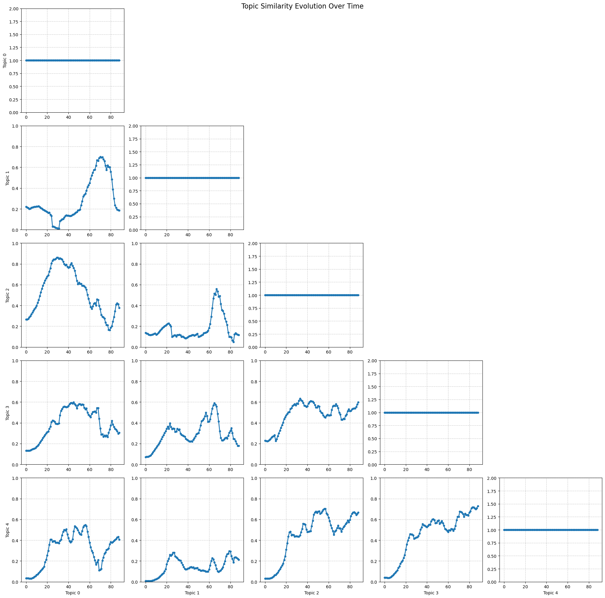

Aqui vemos una matriz de correlacion donde en cada casilla hay un plot de la correlacion en el tiempo entre cada dos topicos. La similaridad se ha calculado como la similaridad del cosine entre el vector de pesos de todas las palabras del corpus en cada instante de tiempo.

Se observa como el maximo valor se obtiene entre el topico 0  y el 2 llegando casi a una similitud del 0.9. En general parece que la correlacion entre todos los topicos tiene un pico casi al final, aunque en muchos casos baja a valores bajos poco despues. En general la correlacion ronda entre 0.4 y 0.6.

Esta es la distribucion de los topicos en el corpus:
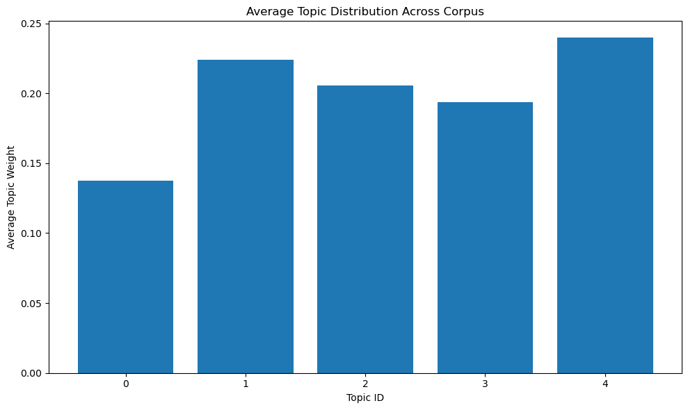

Se observa como el topico 4 es el más presente en el corpus aunque es bastante parecida entre todos los topicos excepto el 0 el cual es el que menos presencia tiene en el corpus.

# Tecnica 3: Análisis de sentimiento
Tras realizar el análisis de sentimientos, visualizamos los datos para interpretar mejor los resultados. El código se incluye en el cuaderno *results_for_sentiment_analysis.ipynb*.

## Análisis del sentimiento a lo largo de los años:
El primer gráfico muestra la distribución de los sentimientos a lo largo de los años. 

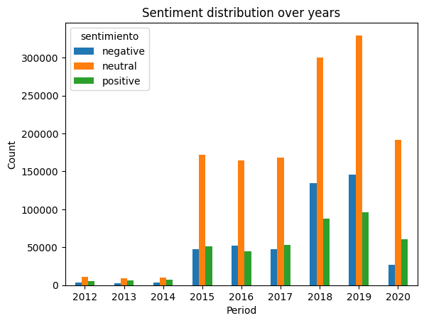

Se puede observar que nuestro conjunto de datos está desequilibrado, ya que hay muy pocos datos de los años 2012-2014 en comparación con los años siguientes. También podemos observar que la gran mayoría de los datos tienen un sentimiento neutro.

## Análisis del sentimiento a lo largo de los periodos electorales
Luego, para visualizarlo mejor, dividimos los datos en dos periodos electorales: 2012-2016, cuando Obama era el presidente, y 2017-2020, cuando lo era Trump. 

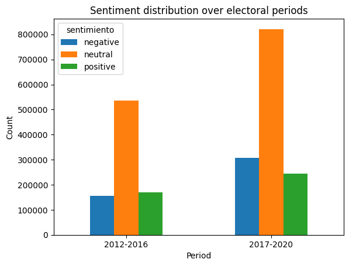

De nuevo, la mayoría de los datos son neutrales. Podemos observar que, mientras que durante el periodo demócrata la cantidad de datos negativos y positivos era similar, definitivamente hay más datos negativos durante el periodo republicano.

# Tecnica 5: Modelado de Series Temporles

Como resultado de la aplicación de modelos temporales a los datos de la bolsa de Apple y al sentimiento de las noticias, hemos obtenido los siguientes gráficos:

### Predicciones con ARIMA
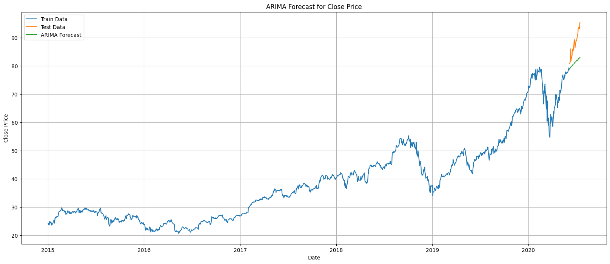

### Predicciones con ARIMAX
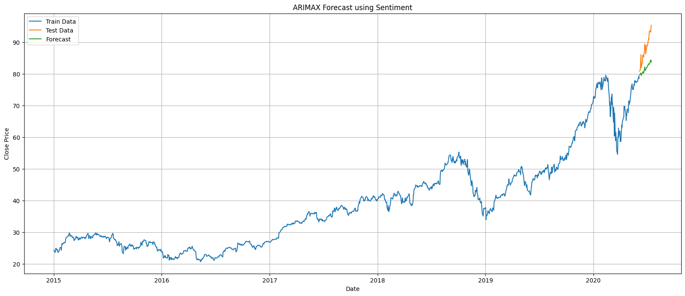

### MAX aplicado a los valores de bolsa
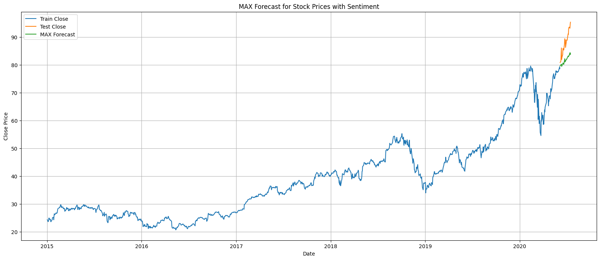
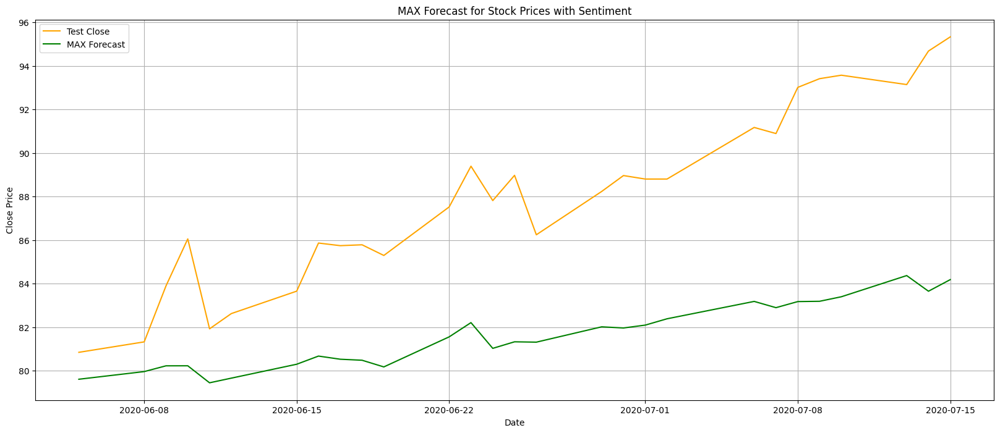

### MAX aplicado al sentimiento
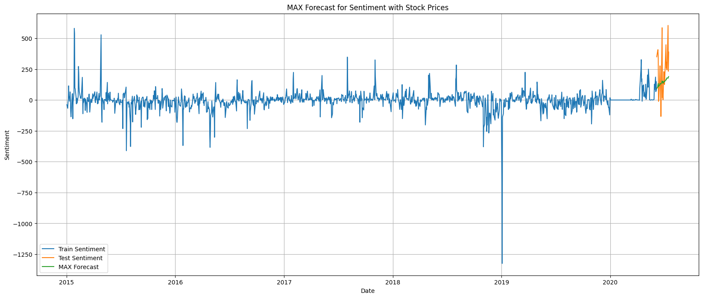
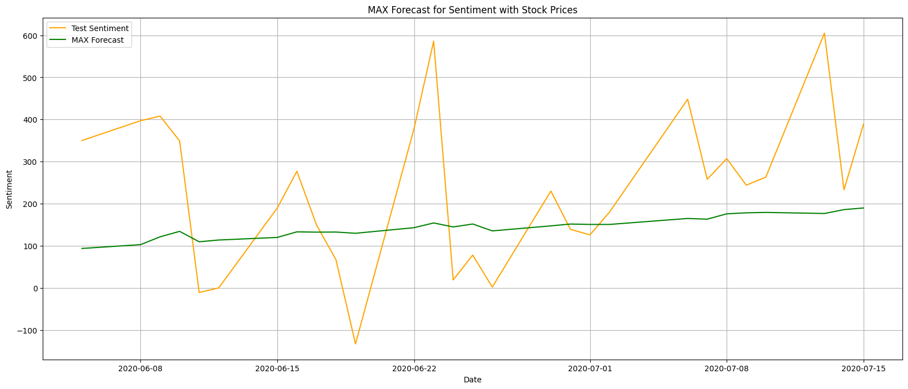

