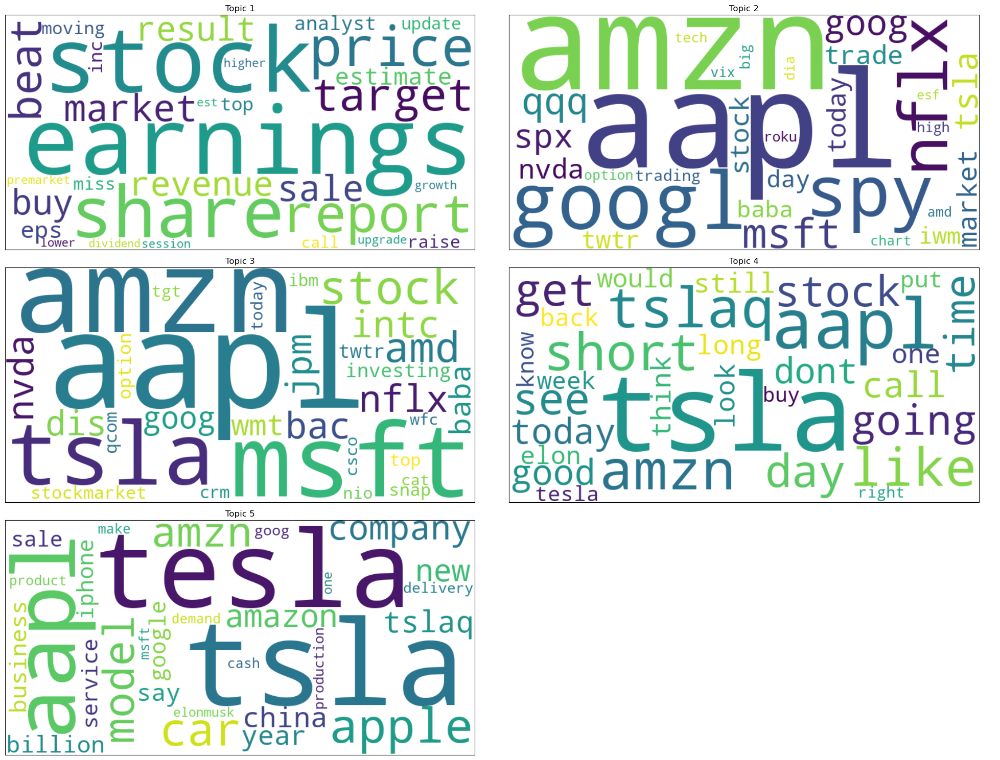
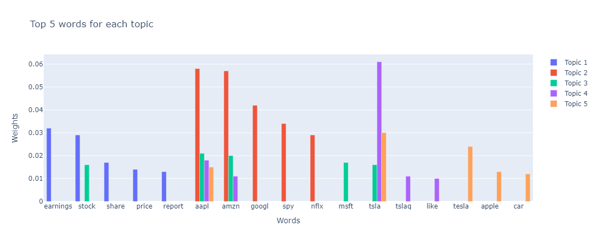
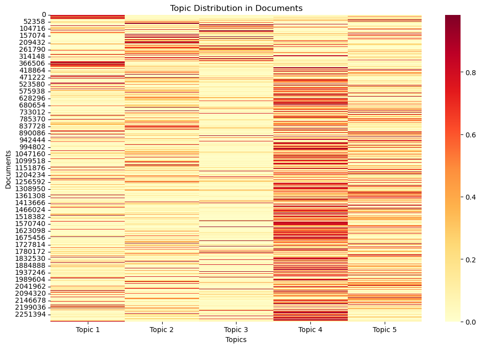
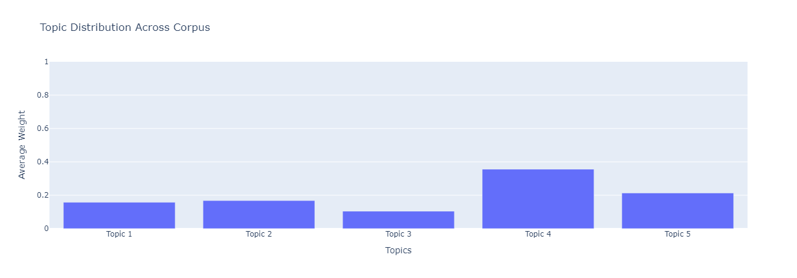
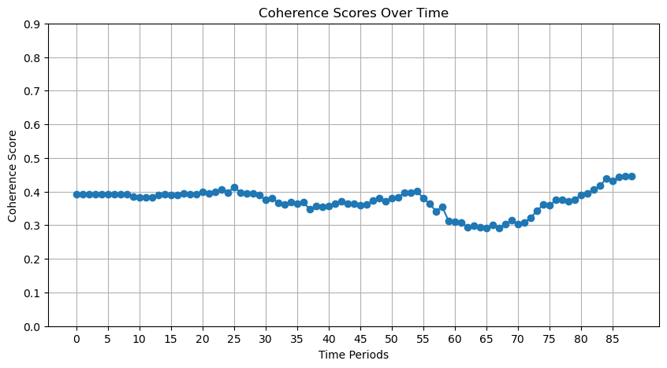

# Tecnica 1: Latent Dirichlet allocation (LDA)

## WordCloud

Como primer resultado vamos a visualizar las palabras más importantes de cada tópico en un WordCloud.

## Palabras más importantes de los tópicos

De los 5 tópicos extraido por el método LDA mostramos aquí los pesos de las 5 palabras más importantes de cada tópico.

Se puede apreciar como muchas palbaras se superponen en los tópicos, apereciendo en varios tópicos a la vez. Principalmente appl que aparece en 4 de los 5 tópicos así como tsl y amzn que aparecen en 3 de los 5 tópicos. Estas palabras representan tickers del mercado y vemos como tienen mucha importancia en el texto pero no nos aportan información sobre el contenido de los tópicos. Debido a la falta de tiempo en esta entrega no se ha ajustado el prepocesado pero se podría ajustar para los tickers del corpus.

## Significado de los tópicos

Topic 0: 0.032*"earnings" + 0.029*"stock" + 0.017*"share" + 0.014*"price" + 0.013*"report"
Topic 1: 0.058*"aapl" + 0.057*"amzn" + 0.042*"googl" + 0.034*"spy" + 0.029*"nflx"
Topic 2: 0.021*"aapl" + 0.020*"amzn" + 0.017*"msft" + 0.016*"tsla" + 0.016*"stock"
Topic 3: 0.061*"tsla" + 0.018*"aapl" + 0.011*"amzn" + 0.011*"tslaq" + 0.010*"like"
Topic 4: 0.030*"tsla" + 0.024*"tesla" + 0.015*"aapl" + 0.013*"apple" + 0.012*"car"

1. El primer tópico parece una generalizacion sobre el mercado de valores, con palabras como "earnings", "stock", "share", "price" y "report".
2. El segundo tópico parece estar relacionado con las acciones de las empresas más grandes de la bolsa, con palabras como "aapl", "amzn", "googl", "spy" y "nflx".
3. El tercer tópico es similar al anterioir y también contiene palabras relacionadas con las acciones de las empresas más grandes de la bolsa, con palabras como "aapl", "amzn", "msft", "tsla" y "stock".
4. El cuarto tópico también se parece al segundo y tercero y contiene palabras de tickers de la bolsa, con palabras como "tsla", "aapl", "amzn", "tslaq" y "like".
5. El quinto tópico también contiene palabras de tickers de la bolsa, con palabras como "tsla", "tesla", "aapl", "apple" y "car".

Vemos como no parece que los tópicos sean muy distintos entre sí, ni parezcan tener un significado claro. Esperamos que quitando los tickers del corpus se puedan obtener tópicos más claros y distintos entre sí.

## Heatmap

Vemos como el topico 4 parece ser el que mayor "fuerza" ha tenido en el corpus. Tambiém se aprecian patrones como en el topico 1 que tuvo dos franjas de documentos seguidos en los que fue el tópico principal.

## Distribución de tópicos en el corpus

Vemos como el topic 3 es el que más aparece en el corpus con un 35.56% de las noticias, seguido del topic 4 con un 21.32% de las noticias. Los tópicos 0, 1 y 2 aparecen en un 15.72%, 16.74% y 10.41% de las noticias respectivamente.

# Tecnica 2: Modelo dinámico de tópicos (DTM)

## Coherence Over Time

Graficando la coherencia en base a los time slices obtenemos el siguiente gráfico:

Vemos como la coherencia ronda en torno al 0.40 pero hay un pequeño bajón en torno al time slice 35 que se recupera hacia el 0.4 y otro bajon mas grande en torno al slice 65 el cual incluso se recupera con más fuerza y sobrepasa el 0.4.

Graficando como cambian los pesos de las 5 palabras más importantes de cada tópico en el tiempo obtenemos el siguiente gráfico:

Se observa como tendencia que gran parte del peso del topico se apoya en unas 2 o 3 palabras en cada instante de tiempo.

Graficando la similitud entre los tópicos obtenemos el siguiente gráfico:

Aqui vemos una matriz de correlacion donde en cada casilla hay un plot de la correlacion en el tiempo entre cada dos topicos. La similaridad se ha calculado como la similaridad del cosine entre el vector de pesos de todas las palabras del corpus en cada instante de tiempo.

Esta es la distribucion de los topicos en el corpus:

Se observa como todos los topicos tienen parecida distribucion en el corpus, teniendo el topico 4 un poco más de peso que los demás y el 0 un poco menos.
# Tecnica 3: Análisis de sentimiento
Tras realizar el análisis de sentimientos, visualizamos los datos para interpretar mejor los resultados. El código se incluye en el cuaderno *results_for_sentiment_analysis.ipynb*.

El primer gráfico muestra la distribución de los sentimientos a lo largo de los años. 

Se puede observar que nuestro conjunto de datos está desequilibrado, ya que hay muy pocos datos de los años 2012-2014 en comparación con los años siguientes. También podemos observar que la gran mayoría de los datos tienen un sentimiento neutro.

Luego, para visualizarlo mejor, dividimos los datos en dos periodos electorales: 2012-2016, cuando Obama era el presidente, y 2017-2020, cuando lo era Trump. 

De nuevo, la mayoría de los datos son neutrales. Podemos observar que, mientras que durante el periodo demócrata la cantidad de datos negativos y positivos era similar, definitivamente hay más datos negativos durante el periodo republicano.
